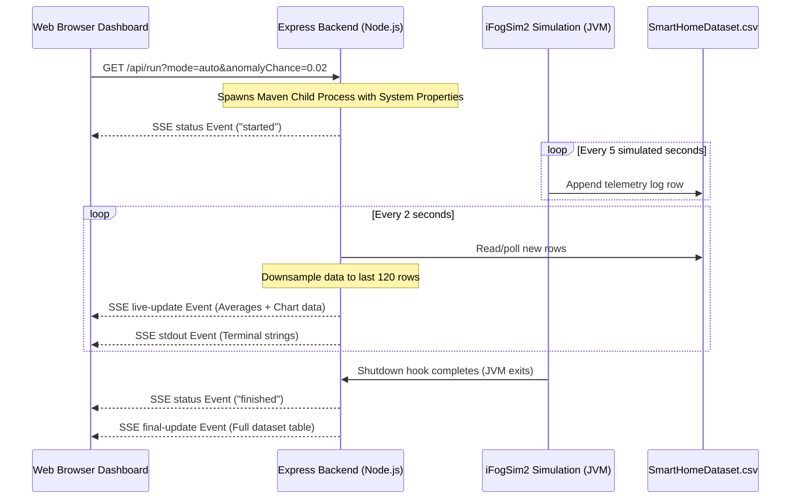
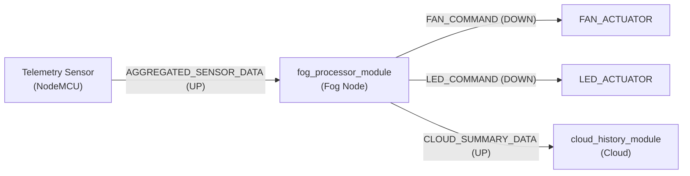

# Homestead Fog Computing Simulation Overview

This document provides a comprehensive technical overview of the Homestead Fog Computing Simulation. It details the architecture of the simulated environment, the mathematical models behind the sensors, the decision engine rules, and explains the rationale for using software simulation alongside physical hardware prototyping.

---

## 1. Simulation vs. Hardware: Why Software Modeling Matters

When building IoT and edge-computing applications, developing a **software simulation** (e.g., using iFogSim2/CloudSim) in parallel with a **physical hardware setup** (e.g., NodeMCU ESP8266, Raspberry Pi) is a scientific standard. Each serves a distinct purpose:

| Aspect | Software Simulation (iFogSim2) | Physical Hardware (ESP8266/Pi) |
| :--- | :--- | :--- |
| **Scalability** | **Extremely High**: Spin up thousands of smart homes, gateways, and cloud nodes on a single machine for $0. | **Low / Expensive**: Scale is limited by budget and physical workspace to a few microcontrollers. |
| **Network Control** | **Deterministic**: Instantly simulate specific WAN latency (e.g., 150ms storm delays) or packet drops by changing config variables. | **Difficult**: Emulating network drops or jitter requires specialized switches or routing configs. |
| **Power Measurement** | **Algorithmic**: Computes energy usage (in Megajoules/Joules) continuously based on MIPS workload models. | **Hardware-Intensive**: Requires physical multimeters, probes, and current-monitoring circuits. |
| **Deployment Speed** | **Instant**: Modify code and run immediately. | **Slow**: Requires compiling, flashing over USB/OTA, and power-cycling individual nodes. |
| **Reproducibility** | **Perfect**: The exact same inputs and conditions can be replayed to compare algorithms. | **Variable**: Ambient noise, Wi-Fi interference, and component heat drift inject random variance. |

* **Research Strategy**: The software simulation behaves as a **wind tunnel** to validate algorithms, network load, and energy footprints mathematically. The physical hardware acts as the **real-world proof of concept**.

---

## 2. Hierarchical System Topology

The simulation models a three-tier hierarchical fog topology representing a household connected to a localized edge processing server and a remote centralized cloud.

```mermaid
graph TD
    subgraph Tier 0: Centralized Cloud [Cloud Datacenter]
        Cloud[Cloud Server<br/>MIPS: 44,800 | RAM: 40,000 MB]
    end

    subgraph Tier 1: Local Edge [Fog Gateway]
        Fog[Fog Node Gateway<br/>MIPS: 2,800 | RAM: 4,000 MB]
    end

    subgraph Tier 2: Physical Room [Smart Controller]
        MCU[NodeMCU ESP8266<br/>MIPS: 80 | RAM: 4 MB]
    end

    subgraph Peripherals & Environment
        DHT[Virtual DHT11/LDR Hub]
        Fan[Fan Actuator]
        LED[LED Actuator]
    end

    Cloud <-->|WAN: 40ms Latency / 100Mbps Bandwidth| Fog
    Fog <-->|LAN: 2ms Latency / 100Mbps Bandwidth| MCU
    MCU -.->|Reads Telemetry| DHT
    MCU -.->|Commands| Fan
    MCU -.->|Commands| LED
```

### Physical Properties of Topology Nodes

1. **Cloud Datacenter (`cloud`)**
   * **MIPS**: 44,800 (massive batch computing power)
   * **RAM**: 40,000 MB
   * **Function**: Serves as the long-term historical database. Telemetry tuples are sent here from the gateway for archival logs.
2. **Fog Node Gateway (`fog-node`)**
   * **MIPS**: 2,800 (intermediate power)
   * **RAM**: 4,000 MB
   * **Function**: Runs the real-time `DecisionEngine.java` checking rules and writing telemetry to the CSV database.
3. **NodeMCU ESP8266 (`nodemcu-controller`)**
   * **MIPS**: 80 (low-power edge microcontroller)
   * **RAM**: 4 MB
   * **Function**: Acts as a localized sensor hub. It reads environmental signals and routes command packets to individual actuators.

---

## 3. Environmental Telemetry & Sensor Models

Sensors emit data every **5 simulated seconds** (`SENSOR_INTERVAL = 5.0`). The values are modeled mathematically in `VirtualSensor.java` to replicate diurnal trends, noise, and occupancy influence.

### Mathematical Value Generation

* **DHT11 Temperature Sensor**
  * Models a 24-hour diurnal temperature cycle peaking around 3:00 PM and hitting a minimum at 3:00 AM.
  * *Base Formula*: $T_{base} = 30.0 + 8.0 \cdot \sin\left(\frac{2\pi \cdot (\text{simTime} - 32400)}{86400}\right) + \text{noise}$
  * *Occupancy Term*: If `Occupancy = 1` (occupied), temperature increases by $+1.0^\circ\text{C}$ to simulate human body heat.
* **DHT11 Humidity Sensor**
  * Modeled as inversely proportional to the outdoor temperature.
  * *Base Formula*: $H_{base} = 65.0 - 15.0 \cdot \sin\left(\frac{2\pi \cdot (\text{simTime} - 32400)}{86400}\right) + \text{noise}$
  * *Occupancy Term*: If occupied, humidity spikes randomly by $+5.0\%$ to simulate domestic activity.
* **LDR Light Sensor**
  * Ranges from `0` (complete darkness) to `1023` (brightest sunlight).
  * *Base Formula*: Peaks at 12:30 PM. During nighttime (10:00 PM to 5:00 AM), it defaults to a low ambient level (`40 - 80` units).
* **Occupancy Modulator**
  * On weekdays, occupancy drops to `0` (unoccupied) with a 90% probability between 9:00 AM and 5:00 PM, representing work and school routines. On weekends, occupancy remains `1` (occupied) with short afternoon outings.

### Anomaly Injection (Default Rate: 2%)
Anomalies are injected randomly to test the resilience of the decision engine:
* **Temperature Anomalies**: Simulates fires (temperature climbs to $50^\circ\text{C}$+) or extreme freezing drafts (temperature drops to $5^\circ\text{C}$).
* **Light Anomalies**: Simulates sensor covering (reading drops instantly to `0`) or light bulb failure.

---

## 4. Decision Engine Rules & Overrides

The Fog Node processes incoming sensor telemetry using classification rules in `DecisionEngine.java`.

### Greenhouse Energy Policy (Occupancy Overrides)
To prevent energy waste, if the home is unoccupied (`Occupancy = 0`), the actuators are instantly forced **OFF**, regardless of environmental sensor readings:
$$\text{Occupancy} = 0 \implies \text{Fan} = \text{OFF}, \text{LED} = \text{OFF}$$

### Occupied Mode Rules (`Occupancy = 1`)
When occupants are present, the actuators trigger based on environmental comfort levels:
* **Smart Fan**: Turns **ON** if temperature exceeds **$30.0^\circ\text{C}$**, else **OFF**.
* **Smart LED**: Turns **ON** if light intensity drops below **$400$ LDR units**, else **OFF**.

### Combined Actuator State Labels
Actuator combinations are classified into classification labels suitable for machine learning training:
1. `FAN_ON_LED_ON` (Hot and dark room)
2. `FAN_OFF_LED_OFF` (Comfortable temp, ambient daylight)
3. `FAN_ON_LED_OFF` (Hot and bright room)
4. `FAN_OFF_LED_ON` (Comfortable temp, dark room)

---

## 5. SSE Data-Streaming Pipeline & Dashboard

The web dashboard coordinates the simulation runner and visualizes the telemetry output in real-time.



1. **Parameters Injection**: The user sets the **Actuator Control Mode** and **Anomaly Injection Rate** in the dashboard.
2. **Process Spawn**: The Express server spawns the Maven process using `mvn clean compile exec:java -DactuatorMode=... -DanomalyChance=...`.
3. **SSE Feed**: The child process's console output (`stdout`) is piped immediately to the browser console.
4. **Telemetry Downsampling**: To prevent dashboard rendering lag during long runs, the Node.js server downsamples the dataset rows to a maximum of 120 points before pushing them to the Chart.js visualizer.
5. **Glow Animations**: During active simulation runs, link packet SVG flow speed accelerates and node cards adjust glow states based on real-time actuator triggers.

---

## 6. Dataset Schema — SmartHomeDataset.csv

Every simulated sensor tick writes one row to `SmartHomeDataset.csv`. The dataset is the primary output artifact, intended for downstream Machine Learning model training.

| Column | Type | Description |
| :--- | :--- | :--- |
| `SimulationTime(s)` | `Float` | Internal CloudSim timestamp in seconds |
| `Temperature` | `Float` | DHT11 temperature reading in °C |
| `Humidity` | `Float` | DHT11 relative humidity in % |
| `LightIntensity` | `Integer` | LDR raw light intensity (0–1023) |
| `Occupancy` | `Integer` | 0 = unoccupied, 1 = occupied |
| `DayOfWeek` | `Integer` | 0 = Monday … 6 = Sunday |
| `IsWeekend` | `Boolean` | true if day is Saturday or Sunday |
| `IsAnomaly` | `Boolean` | true if a synthetic anomaly was injected |
| `FanStatus` | `String` | `"ON"` or `"OFF"` |
| `LEDStatus` | `String` | `"ON"` or `"OFF"` |
| `DecisionLabel` | `String` | Combined actuator state (e.g., `FAN_ON_LED_OFF`) |
| `FogProcessingTime(ms)` | `Float` | Simulated time taken to process on Fog Node |
| `CloudLatency(ms)` | `Float` | Network round-trip to Cloud Datacenter |
| `EnergyConsumption(W)` | `Float` | Instantaneous power draw at this timestep |

### Dataset Sizing
* **Sensor interval**: Every **5 simulated seconds** = 1 row.
* **Total simulation duration**: **50,005 simulated seconds**.
* **Total rows generated**: ~**10,001 rows** per full run.

---

## 7. iFogSim2 Application Model & Tuple Data-Flow

The iFogSim2 framework models the simulation as an **Application Graph** — a directed graph of processing modules linked by typed data edges (called **Tuples**). Understanding this graph is essential to understanding how data flows through the hierarchy.



### Key Edges Explained

| Edge | Direction | CPU Load | Payload | Meaning |
| :--- | :--- | :--- | :--- | :--- |
| `AGGREGATED_SENSOR_DATA` | UP (Sensor → Fog) | 10 MI | 100 bytes | Full sensor tick bundle sent every 5s |
| `FAN_COMMAND` | DOWN (Fog → Actuator) | 1 MI | 10 bytes | Binary fan toggle command |
| `LED_COMMAND` | DOWN (Fog → Actuator) | 1 MI | 10 bytes | Binary LED toggle command |
| `CLOUD_SUMMARY_DATA` | UP (Fog → Cloud) | 5 MI | 50 bytes | Historical data batch forwarded to cloud |

### Selectivity Policy
Each incoming tuple to `fog_processor_module` triggers downstream outputs at a **1.0 fractional selectivity**, meaning **every** sensor reading produces exactly one actuator command and one cloud summary — no batching or sampling at the iFogSim layer.

---

## 8. Output Files & Artifacts

At the end of each simulation run, three output files are written to the project root:

### `SmartHomeDataset.csv`
* ~10,000 rows of structured sensor telemetry, actuator states, and energy metrics.
* **Primary purpose**: ML training dataset for automated actuator classification.

### `PerformanceReport.txt`
A human-readable summary report auto-generated by the JVM Shutdown Hook containing:
* **Total simulation execution time** in real-world milliseconds.
* **Network usage** in bytes (via `NetworkUsageMonitor`).
* **Per-device energy consumption** broken down by Cloud, Fog, and NodeMCU.
* **Average Fog processing latency** and **Cloud round-trip latency** in milliseconds.
* **Fan/LED activation percentages** across the full dataset.

### `SimulationLog.txt`
* Verbatim, timestamped stdout/stderr from the iFogSim2 JVM process.
* Captures tuple transmission events, CloudSim event scheduling info, and any decision engine logs.
* Written in **DualStream** mode — simultaneously piped to both this file and the browser's terminal console.

---

## 9. Technology Stack

| Layer | Technology | Role |
| :--- | :--- | :--- |
| **Simulation Core** | [iFogSim2](https://github.com/Cloudslab/iFogSim) | Fog-aware CloudSim extension for application scheduling |
| **Base Simulator** | CloudSim 3.0 | Discrete event simulation engine |
| **Build Tool** | Apache Maven 3.9.6 | Java dependency management and execution |
| **Backend Server** | Express.js (Node.js) | REST API + SSE event bus, CSV poller |
| **Frontend Charts** | Chart.js | Real-time telemetry dual-axis line chart |
| **Topology Viz** | Inline SVG + SMIL Animations | Packet flow animations between topology levels |
| **Dashboard Font** | Manrope + Fraunces (Google Fonts) | Humanist sans for data labels, serif for headings |
| **Communication** | Server-Sent Events (SSE) | Unidirectional push stream from backend to browser |

---

## 10. How to Run the Simulation

### Prerequisites
1. **JDK 8+** installed and `JAVA_HOME` set.
2. **Node.js 18+** and `npm` installed.
3. Apache Maven is bundled at `maven/apache-maven-3.9.6/` — no installation needed.

### Steps

```bash
# 1. Install Node.js dependencies (one-time)
cd webapp
npm install

# 2. Start the web server
node server.js

# 3. Open the dashboard in your browser
#    Navigate to: http://localhost:3000
```

Then click **Run Simulation** in the dashboard, or use the Config panel to adjust the **Anomaly Injection Rate** or **Actuator Control Mode** before running.

### Running Directly via Maven (CLI)
```bash
cd d:\ECS
maven\apache-maven-3.9.6\bin\mvn.cmd clean compile exec:java \
    -Dexec.mainClass=com.smarthome.MainSimulation \
    -DactuatorMode=auto \
    -DanomalyChance=0.02
```

---

## 11. Future Roadmap

The following enhancements are planned for future iterations of this simulation:

| Feature | Priority | Description |
| :--- | :--- | :--- |
| **Anomaly Alerting on Topology** | High | Flash node cards in `--crimson` glow color when `IsAnomaly: true` is detected in the SSE stream. |
| **Pause/Resume Simulation** | Medium | Implement `SIGSTOP`/`SIGCONT` signal-based process management from the Express server. |
| **ML Model Integration** | High | Train a Random Forest / XGBoost classifier on the generated dataset to replace the rule-based `DecisionEngine`. |
| **Multi-Room Expansion** | Medium | Model a multi-room household with separate sensor hubs per room, each routed through a shared Fog Gateway. |
| **Battery/Solar Simulation** | Low | Extend `EnergyCalculator.java` to model solar panel recharging and microcontroller battery drain cycles. |
| **Hardware-in-the-Loop (HIL)** | Long-term | Bridge the simulation to the physical NodeMCU ESP8266 by forwarding the simulated sensor values to the real microcontroller over MQTT, closing the loop between software and hardware. |
