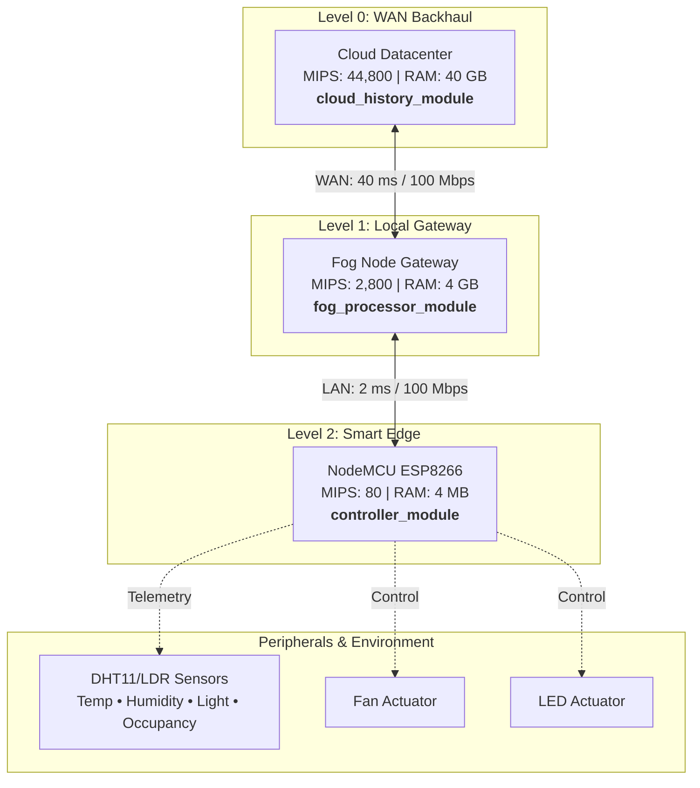
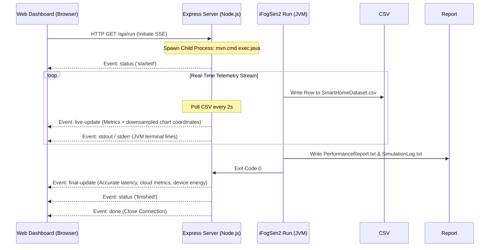

# Smart Home Automation System Architecture & Workflow

This project is a high-fidelity fog computing simulation that models an automated smart home network. By integrating **iFogSim2** and **CloudSim**, it simulates realistic sensor telemetry, local edge decision-making, and wide-area cloud history archival. A web dashboard controls execution, rendering real-time metrics, topology packet flows, and dataset charts.

---

## 1. System Architecture & Topology

The network is modeled as a hierarchical tree with three levels of processing power and distinct operational responsibilities:

### Physical Node Properties

| Node | MIPS | RAM | Network Link Role |
| :--- | :--- | :--- | :--- |
| **Cloud Datacenter** | 44,800 MIPS | 40,000 MB | Long-term archival, heavy analytical storage |
| **Fog Node Gateway** | 2,800 MIPS | 4,000 MB | Local local decision-making, CSV dataset logging |
| **NodeMCU Controller** | 80 MIPS | 4 MB | Local sensor hub, physical command dispatcher |

---

## 2. Simulation Logic & Virtual Sensors

The virtual sensors emit data every **5 simulated seconds** (`SENSOR_INTERVAL = 5.0`). The system models realistic household telemetry with noise and synthetic anomalies:

* **DHT11 Temperature Sensor**: Follows a diurnal sine-wave pattern peak-rated around 3:00 PM and lowest at 3:00 AM (range: `20°C - 40°C`). Adjusts `+1.0°C` when the house is occupied due to ambient heat.
* **DHT11 Humidity Sensor**: Inversely proportional to temperature (range: `35% - 90%`), with standard spikes during active occupancy (cooking/showers).
* **LDR Light Sensor**: Ranges from `0` (pitch black) to `1023` (full sunlight), peaking at 12:30 PM. Night ambient level sits around `40 - 80` units.
* **Occupancy / Anomaly Generator**:
  * Occupancy is toggled randomly based on time of day (work hours/night).
  * Anomaly injections (2% chance) simulate freezing drafts/fire spikes (temperature drops to `5°C` or spikes to `50°C`), sensor covering (light drops to `0`), or sensor malfunctions (light spikes to `1023`).

---

## 3. Decision Engine & Control Rules

The Fog Node runs the local classification logic `DecisionEngine.java`:

> [!NOTE]
> **Greenhouse Energy Policy**
> If **Occupancy = 0** (unoccupied), both actuators (Fan & LED) are immediately forced **OFF** to prevent energy waste, overriding all environment thresholds.

If the house is occupied (**Occupancy = 1**):
* **Fan Status**: Turned **ON** if temperature exceeds **30.0°C**, else **OFF**.
* **LED Status**: Turned **ON** if light intensity drops below **400 LDR**, else **OFF**.

### Combined Actuator State Matrix
Decisions are mapped into combined labels suitable for downstream Machine Learning classifiers:
1. `FAN_ON_LED_ON` (High temp, low light)
2. `FAN_OFF_LED_OFF` (Comfortable temp, ambient light)
3. `FAN_ON_LED_OFF` (High temp, ambient light)
4. `FAN_OFF_LED_ON` (Comfortable temp, low light)

---

## 4. Web Dashboard & SSE Streaming Pipeline

The Express backend wraps the Maven executor and exposes the simulation stream to the browser:

* **Live Telemetry Charts**: Chart.js rendering of temperature and light curves downsampled to 120 key frame intervals for high performance.
* **Network Topology Map**: Fully animated schematic rendering node card energy states (MJ/kJ/J) and real-time SVG particles moving along the link tracks to visualize telemetry streams.
* **Dataset Explorer**: Paginated, searchable grid containing all output tuples, highlighting anomaly rows in red.
